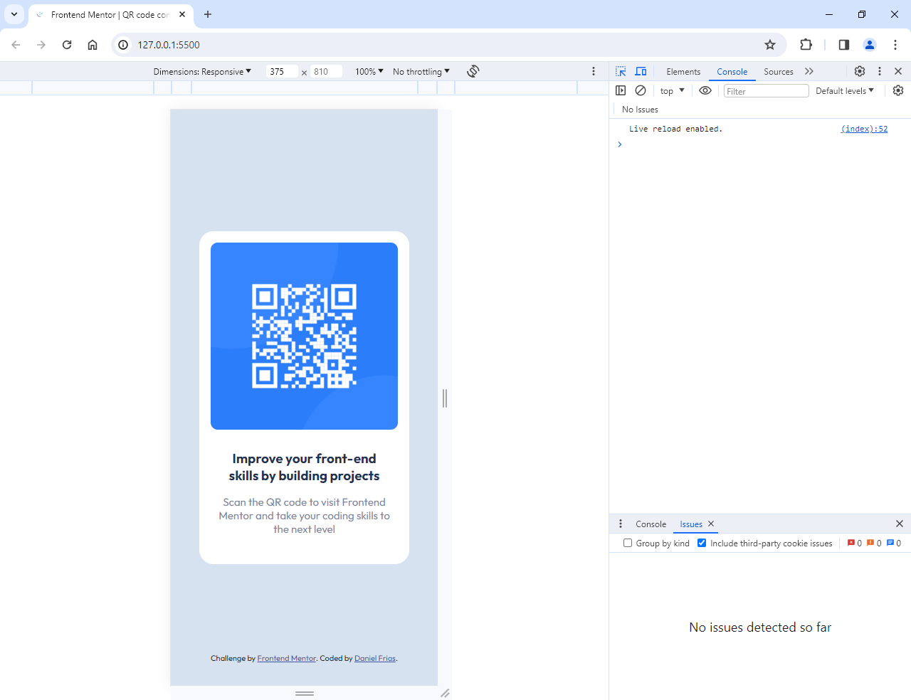
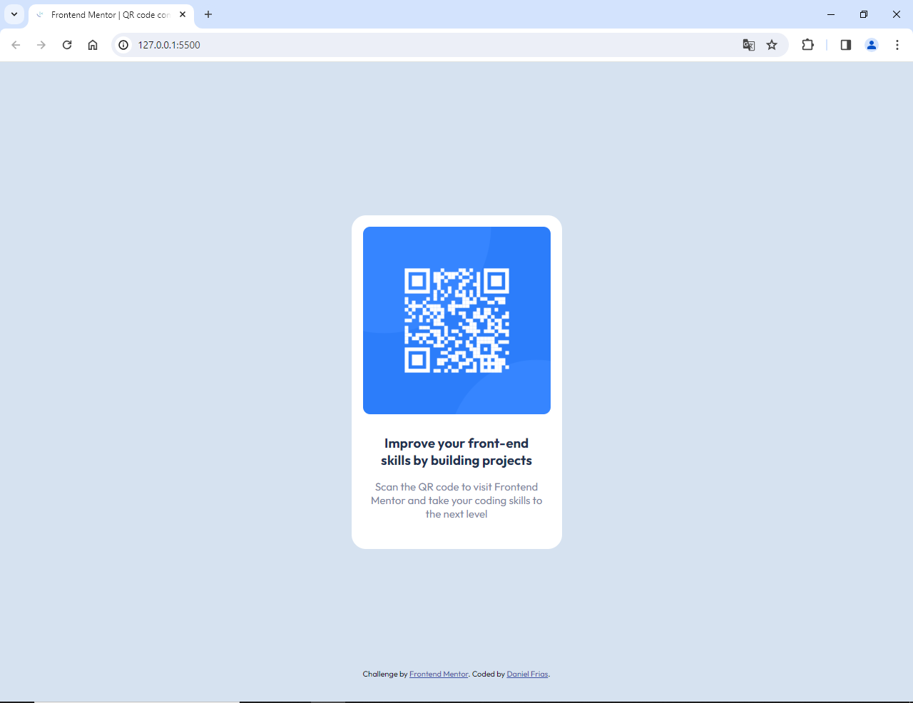

# Frontend Mentor - QR code component solution

This is a solution to the [QR code component challenge on Frontend Mentor](https://www.frontendmentor.io/challenges/qr-code-component-iux_sIO_H). Frontend Mentor challenges help you improve your coding skills by building realistic projects. 

## Table of contents

- [Overview](#overview)
  - [Screenshot](#screenshot)
  - [Links](#links)
- [My process](#my-process)
  - [Built with](#built-with)
  - [What I learned](#what-i-learned)
  - [Continued development](#continued-development)
- [Author](#author)

## Overview

This frontend project is a basic implementation of a card component that contains a QR, title and description. It is useful for show information visually attractive and concise.

### Screenshot

Mobile:

Desktop:

### Links

- Solution URL: [Add solution URL here](https://your-solution-url.com)
- Live Site URL: [Add live site URL here](https://your-live-site-url.com)

## My process

### Built with

- Semantic HTML5 markup
- CSS custom properties
- Flexbox
- Mobile-first workflow

### What I learned

This little project served me as practice and understand how to work with Frontend Mentor.

### Continued development

I will continue development projects frontend with React.

## Author

- LinkedIn - [Daniel Omar Frias](https://ar.linkedin.com/in/daniel-omar-frias)
- Frontend Mentor - [@DOF1109](https://www.frontendmentor.io/profile/DOF1109)
